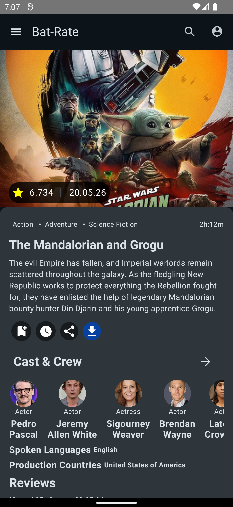
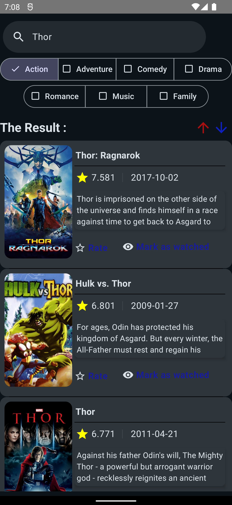

# Bat-Rete 🦇🎬

**Bat-Rete** is a modern, high-performance Android movie application built with **Jetpack Compose**. It provides users with a seamless experience to discover trending movies, search for their favorites, and manage their personalized watchlists.

## 🚀 Features

- **User Authentication**: Secure sign-in and sign-up powered by **Firebase Auth**.
- **Movie Discovery**: Explore trending and popular movies using the **TMDB API**.
- **Smart Search**: Find movies by title with advanced filtering options.
- **Detailed Insights**: View movie details including cast, crew, ratings, and reviews.
- **Personalized Lists**: Save movies to "Watch Later" or "Watched" lists using **Firebase Firestore**.
- **Modern UI/UX**: Fully built with **Jetpack Compose** for a smooth and responsive interface.
- **Splash Screen**: Professional entry with the Android 12+ Splash Screen API.

## 🛠️ Tech Stack & Architecture

This project follows **Clean Architecture** principles and the **MVVM (Model-View-ViewModel)** pattern for maintainability and scalability.

- **Language**: [Kotlin](https://kotlinlang.org/)
- **UI Framework**: [Jetpack Compose](https://developer.android.com/jetpack/compose)
- **Dependency Injection**: [Hilt](https://developer.android.com/training/dependency-injection/hilt-android)
- **Networking**: [Retrofit](https://square.github.io/retrofit/) & [OkHttp](https://square.github.io/okhttp/)
- **Image Loading**: [Coil](https://coil-kt.github.io/coil/)
- **Local Persistence**: [Room Database](https://developer.android.com/training/data-storage/room)
- **Backend**: 
    - [Firebase Authentication](https://firebase.google.com/products/auth)
    - [Firebase Firestore](https://firebase.google.com/products/firestore)
- **JSON Serialization**: [Kotlinx Serialization](https://github.com/Kotlin/kotlinx.serialization)
- **Navigation**: [Jetpack Compose Navigation](https://developer.android.com/jetpack/compose/navigation)

## ⚙️ Setup Instructions

To get this project running locally, follow these steps:

### 1. Prerequisites
- Android Studio Ladybug (or newer)
- TMDB API Key (Get it [here](https://www.themoviedb.org/settings/api))

### 2. Firebase Configuration
- Create a new project in the [Firebase Console](https://console.firebase.google.com/).
- Add an Android app with the package name `com.example.myapplication`.
- Download the `google-services.json` file and place it in the `app/` directory.
- Enable **Email/Password** authentication in the Firebase Auth settings.
- Initialize **Cloud Firestore** in your Firebase project.

### 3. API Key Setup
The project uses the `secrets-gradle-plugin`.
- Create a file named `local.properties` in your root directory if it doesn't exist.
- Add your TMDB API Key:
  ```properties
  apiKey=YOUR_TMDB_API_KEY_HERE
  ```

### 4. Build and Run
- Sync the project with Gradle files.
- Run the `app` module on an emulator or physical device.

## 📸 Screenshots

|               Home Screen               | Movie Details | Search |
|:---------------------------------------:| :---: | :---: |
 

## 📄 License

This project is licensed under the MIT License - see the [LICENSE](LICENSE) file for details.

---
*Developed by Mohammad Srouji *
